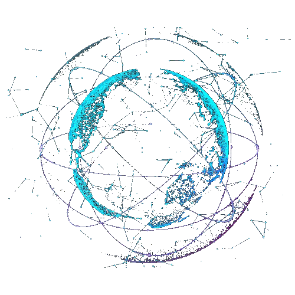
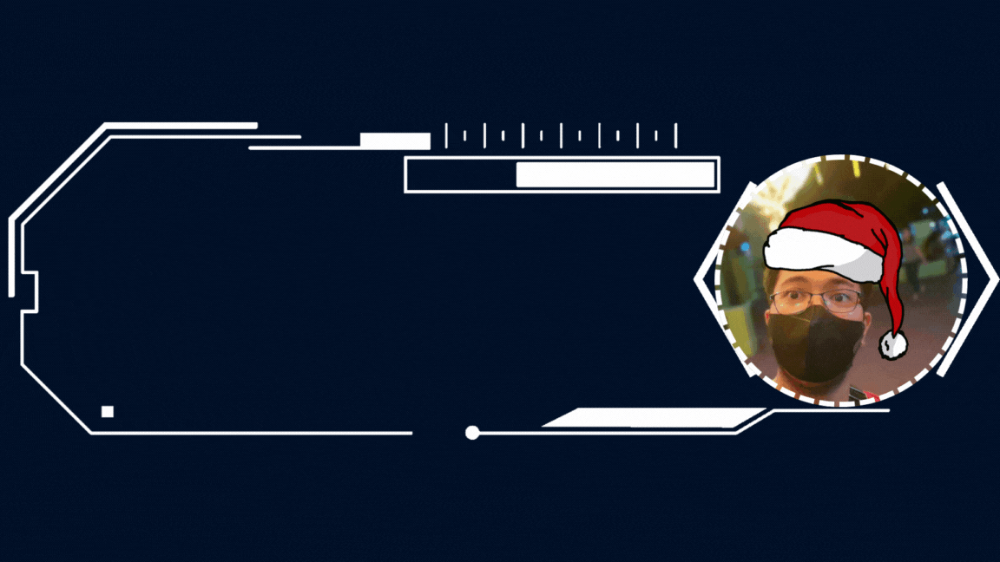
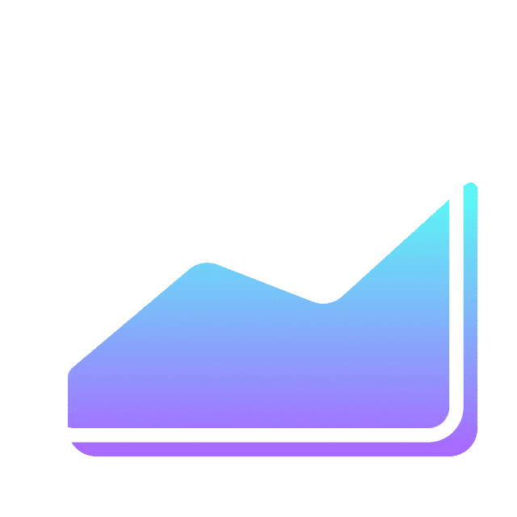
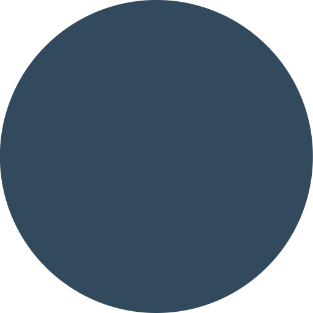

<!-- Banner -->
<div align="center">
  
</div>
<!-- Banner -->

<!-- Hero -->

  
<div align="center">
 
    
 
    
 
</div>


<!-- Hero -->

<!-- Main -->
<section markdown="3" style="display: flex;">

<!-- Profile Views -->
<div align="center">
  <p><b>Profile Views</b></p>
  <p></p>
  <p></p>
</div>

<!-- Profile Views -->

<!-- About Me -->


```JavaScript
export const about_me = [
  {
      name: 'Michael Joshua V. Ruña',
      degree: 'Bachelor of Science in Information Technology',
      learning: 'Next.js',
      hobbies: 'Playing RTS Games, Reading Manga, & Watching Anime',
      portfolio: 'https://vustron-vustronus.vercel.app/',
  },
];

Import about_me from './about_me';

{about_me.map((info) => (
  <p>
  `Hi there, I'm ${info.name}, a college student and pursuing a degree of ${info.degree}.
  I'm also learning {info.learning} My hobbies are ${info.hobbies}.
  And also check out my Porfolio: ${info.portfolio}`
  </p>
))}
```
<!-- About Me -->

<!-- Connect with me -->


<div align="center">
  


<h2>
  <strong>Connect with me </strong> 
</h2>

<p>
  <a href="mailto:mjveranaruna098@gmail.com">
    
  </a>
  <a href="https://github.com/Vustron">
    
  </a>
  <a href="https://www.facebook.com/Vustron.Vustronus">
    
  </a>
  </p>
  
</div>

<div align="center">
  <br>
</div>
<!-- Connect with me -->

<!-- Language and Tools -->


<div align="center" display="flex">
  
  
  <h2>Language and Tools</h2>
</div>

<div align="center">
<table align="center">
<!-- Frontend Technologies Badges -->
  <tr>
    <td align="center">
      
    </td>
    <td align="center">
      
    </td>
    <td align="center">
      
    </td>
    <td align="center">
      
    </td>
    <td align="center">
      
    </td>
  </tr>
  <tr>
    <td align="center">
      
    </td>
    <td align="center">
      
    </td>
    <td align="center">
      
    </td>
    <td align="center">
      
    </td>
    <td align="center">
      
    </td>
  </tr>
  <tr>
    <td align="center">
      
    </td>
<!-- Backend Technologies Badges -->
     <td align="center">
      
    </td>
    <td align="center">
      
    </td>
    <td align="center">
       
    </td>
     <td align="center">
      
    </td>
  </tr>
  <tr>
    <td align="center">
      
    </td>
     <td align="center">
      
    </td>
    <td align="center">
      
    </td>
    <td align="center" >
      
    </td>
    <td align="center">
      
    </td>
  </tr>
  <!-- Tools Technologies Badges Table -->
  <tr>
    <td align="center">
      
    </td>
    <td align="center">
      
    </td>
    <td align="center">
      
    </td>
    <td align="center">
      
    </td>
    <td align="center">
      
    </td>
  </tr>
  <tr>
    <td align="center">
      
    </td>
    <td align="center">
      
    </td>
    <td align="center">
      
    </td>
    <td align="center">
      
    </td>
    <td align="center">
      
    </td>
  </tr>
  <tr>
     <td align="center">
       
    </td>
  </tr>
</table>
</div>


<!-- Language and Tools -->

<!-- Github Stats -->
<div align="center" display="flex">
  
  
  <h2>Github Stats</h2>
</div>

<div align="center">
  <br/>
  
</div>

<div align="center">
  
  
</div>

<div align="center">
  
  
</div>

<div align="center">
  
  
    
</div>          


<div align="center" display="flex">
  
  
  <h2>🐍 A Snake Eating my Contributions Graph</h2>
</div>

<div align="center">
  
</div>
<!-- Github Stats -->


