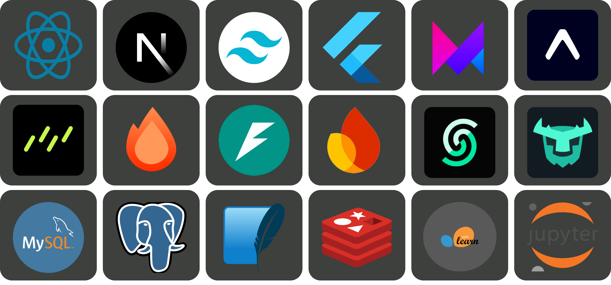
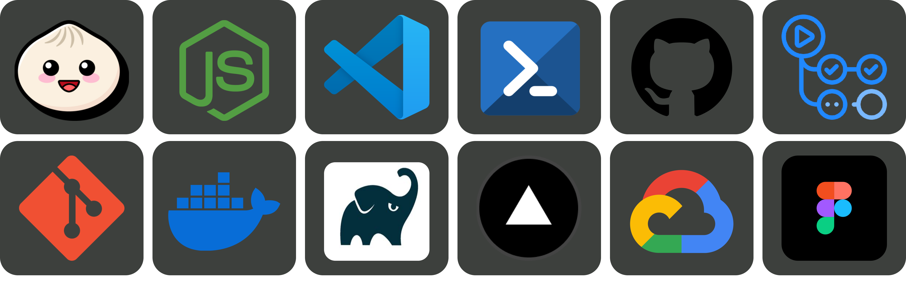

<!-- Header --> 

<!-- About me -->
 

  <h3>Profile Info</h3>
  <kbd>
     

         

        
         <strong>Contact me</strong>
        
        
         
           
          
         

     

   </kbd>
<!--   <kbd>
     

         

         
         <strong>Profile Views</strong>
        
        
           
         

     

   </kbd> -->
   <kbd>
     

         

        
         <strong>Followers Count</strong>
        
        
        
           
        
        
         

     

  </kbd>

 

  

<!-- Language and Tools -->
 

  <h3>Technologies and Tools</h3>
 <kbd>
     

         

        
         <strong>Programming Languages</strong>
        
        
           
         

     

  </kbd>
  <kbd>
     

        

           
            <strong>Libraries,Frameworks & Databases</strong>
           
           
            
         

     

  </kbd>
  <kbd>
     

        

           
            <strong>DevOps</strong>
           
           
            
        

     

  </kbd>

<!-- Github Stats -->

  <h3>Github Stats</h3>

  <!-- Profile Summary and Streak -->
  

    
  

  

    
  

  <!-- Language Stats -->
  

    
    
  

  <!-- Activity Stats -->
  

    
    
  

  <!-- Wakatime Stats -->
  <!-- 

    
  
 -->

  <!-- Trophies -->
  <!-- 

    
  
 -->

 

