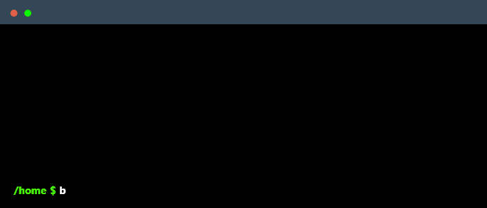

<!-- Banner --->
<!--

  <!-- --->
  <!--

 --->

  

<!-- Main -->
<section markdown="3" style="display: flex;">

<!-- Hero -->
 

   

 
<!-- Hero -->

<!-- About me -->
 

<!-- Connect with me
 

 -->
 

  <h3>Profile Info</h3>
  <kbd>
     

         

        
         <strong>Contact me on gmail & github</strong>  
        
        
         
         

     
 
   </kbd>
  <kbd>
     

         

         
         <strong>Profile Views</strong>  
        
        
           
         

     
 
   </kbd>
   <kbd>
     

         

        
         <strong>Followers Count</strong>
        
        
        
           
        
        
         

     
 
  </kbd>

 

  

<!-- Connect with me

<!-- Language and Tools -->
 

  <h3>Technologies and Tools</h3>
 <kbd>
     

         

        
         <strong>Programming Languages that I know </strong>  
        
        
           
         

     
 
  </kbd>
  <kbd>
     

         

        
         <strong>Frontend Tech that I use</strong>  
        
        
           
         

     
 
  </kbd>
  <kbd>
     

         

        
         <strong>Backend Tech that I use</strong>  
        
        
           
         

     
 
  </kbd>
  <kbd>
     

         

        
         <strong>For Machine-Learning</strong>  
        
        
           
         

     
 
  </kbd>
  <kbd>
     

         

        
         <strong>For Mobile</strong>  
        
        
           
         

     
 
  </kbd>
  <kbd>
     

         

        
         <strong>Deployment, Designing, and other Tools</strong>  
        
        
           
         

     
 
  </kbd>

<!-- Language and Tools -->

<!-- Github Stats -->
 

  <h3>Github Stats</h3>
  
  
  
  
  
  
  
        

<!-- Github Stats 

  
  
  <h2>🐍 A Snake Eating my Contributions Graph</h2>

  

-->

<!-- Github Stats -->

<!-- Projects -->
 

  

    <h3>Projects</h3>
    
    
  

  
  

    
    
  

  

    
    
  

   

    
    
  

  

    
    
  

   

    
    
  

  

    
    
  

  
</section>
